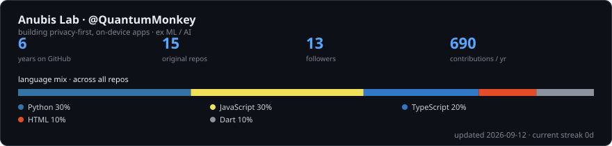

<h1 align="center">Hi 👋, I'm Anand</h1>
<h3 align="center">Building privacy-first, on-device apps · ex ML / AI</h3>

---

### 👨‍💻 About me

- 🔭 I'm currently building **privacy-focused, on-device apps** — local-first, no cloud, no tracking.
- 🧭 The path so far: **software → ML → AI → on-device intelligence**.
- 💡 Into **local-first software, edge inference, and apps that respect your data**.

### 🌐 Connect with me

### 🏅 Hacktoberfest & Holopin

### 🛠️ Languages & Tools

### 📊 GitHub Stats

<!-- self-hosted: regenerated weekly by .github/workflows/profile-stats.yml, served by GitHub -->

